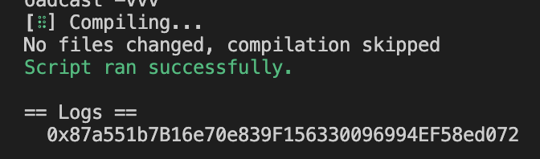
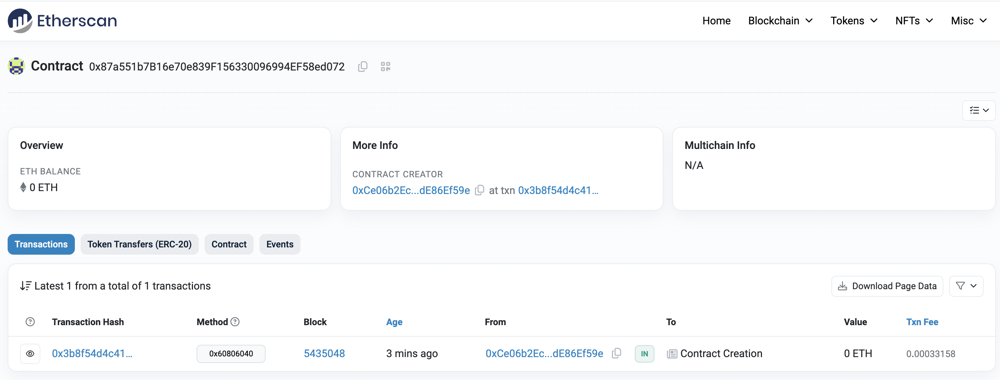

# 2024-Spring-HW0

All the detailed specified in Homework 0 documentation.

## Wallet Address
Please provide your MetaMask wallet address:
Wallet address: 0xCe06b2Ec51192bb7fddbE6F08736124dE86Ef59e

## Local Testing
Please provide a screenshot of the `forge test -vvv` command running in your local environment.

## Contract Address
Please provide the contract address that you deployed on the Sepolia network.
Contract Address: 0x87a551b7B16e70e839F156330096994EF58ed072

## Sepolia Etherscan
Paste the contract address into the Sepolia Etherscan and share the screenshot.
